## h1 Sniff

   ###  x) Lue ja tiivistä. 
#### Karvinen 2025: [Wireshark - Getting Started](https://terokarvinen.com/wireshark-getting-started/)

- Jos käyttöjärjestelmässä ei ole Wiresharkia valmiina (kuten Kali Linuxissa on), niin sille kannattaa tehdä oma käyttäjäryhmä ''wireshark'', jotta sitä ei tarvitse ajaa root-käyttäjänä
- Alkunäkymästä valitaan interface, jota halutaan siepata
- Sieppauksia voi tallentaa myöhempää analysointia varten
- Statistics-menusta voi löytää esim. Endpoints, eli sieppauksessa näkyvät laitteet
- Tuloksia voi filtteröidä esimerkiksi listaamaan tietyt IP-osoitteet. Filtterin voi asettaa myös suoraan tietyn paketin perusteella, eli esimerkiksi valita sen IP-osoitteen tai protokollan filtteriksi.
- Follow - TCP stream -vaihtoehdolla voi katsoa yhden kokonaisen "keskustelun"

#### Karvinen 2025: [Network Interface Names on Linux](https://terokarvinen.com/network-interface-linux/) 

  - Network interface on kuin verkkokortti, mutta se ei välttämättä ole fyysinen, kuten esimerkiksi loopback-interface
  - Uusi nimisysteemi: en = Ethernet, wl = WLAN/WiFi, lo = Loopback
  - Vanhoja nimiä eth0, wlan0
  - Omat interfacet voi katsoa komennolla `ip a` ja reititintaulun `ip route`

### a) Linux. Asenna Debian tai Kali Linux virtuaalikoneeseen. 
Käytän aikaisemmin asentamaani Kali Linuxia.

### b) Ei voi kalastaa. Osoita, että pystyt katkaisemaan ja palauttamaan virtuaalikoneen Internet-yhteyden.

Kalin GUI:n ylälaidassa on verkkointerfacen näköinen ikoni, josta löytyy "Disconnect"-vaihtoehto. Sitä klikkaamalla internetyhteys katkeaa, ja sen saa takaisin klikkaamalla Wired connection 1 -kohtaa. Kuvassa näkyy, kuinka ping aluksi toimii, sitten olen katkaissut nettiyhteyden, eikä ping toimi, ja lopuksi olen palauttanut yhteyden.

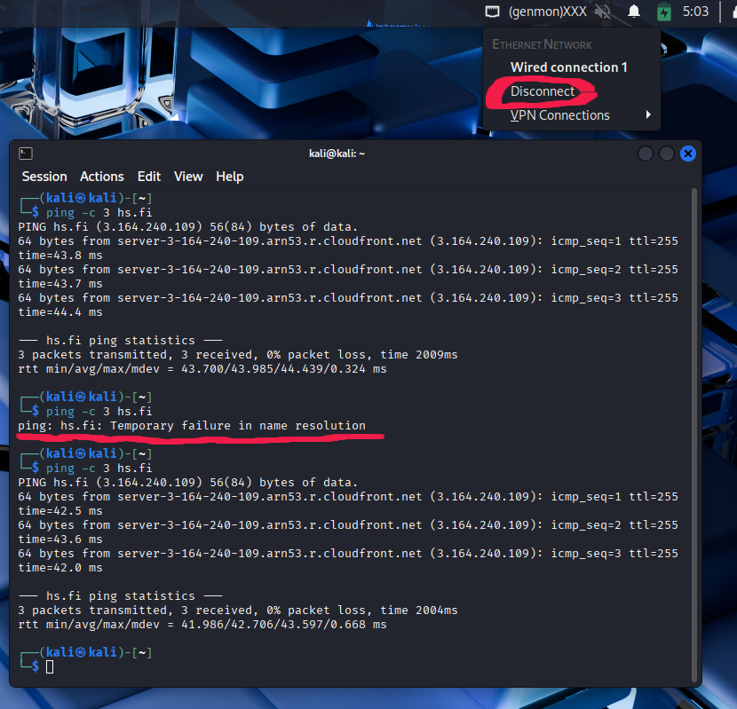

### c) Wireshark. Asenna Wireshark. Sieppaa liikennettä Wiresharkilla. (Vain omaa liikennettäsi. Voit käyttää tähän esimerkiksi virtuaalikonetta).

Wireshark oli Kalissa valmiina. Avasin sen komennolla `wireshark` ja valitsin alkunäkymästä interfacen "eth0". Evän näköisestä ikonista kaappaus lähtee käyntiin ja punaisesta neliöstä sen saa poikki.

Kuvassa näkyy liikennettä, kun selain on Githubissa ja painoin Refresh-nappia.

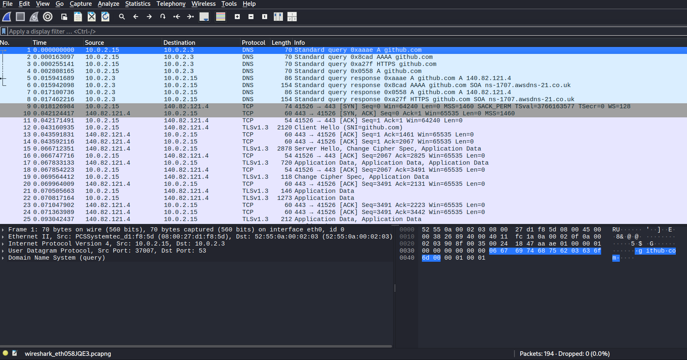

### d) Oikeesti TCP/IP. Osoita TCP/IP-mallin neljä kerrosta yhdestä siepatusta paketista. Voit selityksen tueksi laatikoida ne ruutukaappauksesta. 

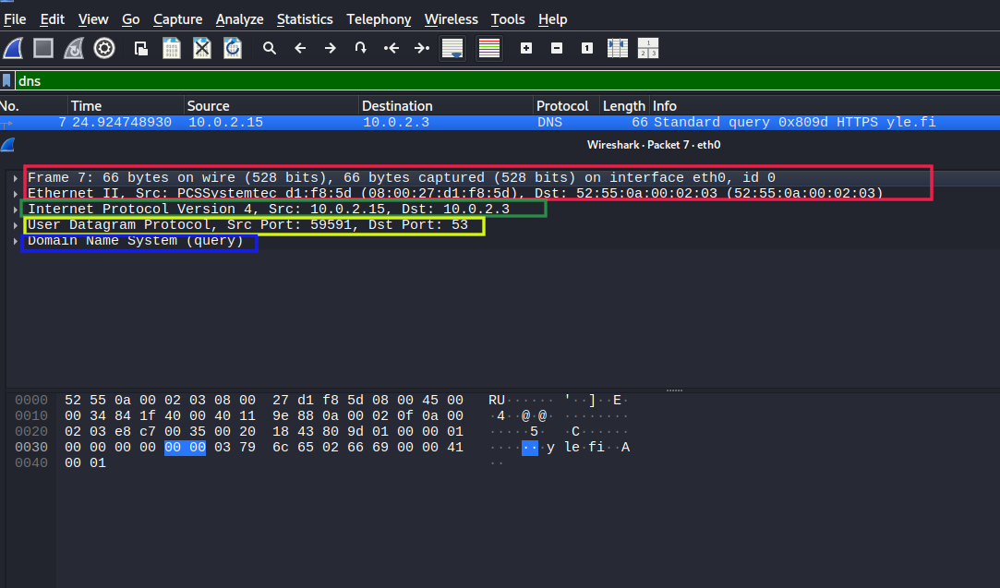

Kuvassa näkyy neljä kerrosta, jotka ovat ylhäältä lähtien:  

__Linkkikerros (Link layer)__  
Frame ja Ethernet - Tämä kerros esittää sitä, miten kehykset kulkevat samassa linkissä yhden hostin interfacesta toiseen. Kuvassa näkyy, kuinka kehyksessä on 66 tavua ja interface on eth0. Ethernet II -kohdassa näkyy lähteen ja kohteen MAC-osoitteet.

__Internet-kerros__  
Internet Protocol Version 4 - Internet-kerroksessa paketit kulkevat IP-osoitteen mukaan. Toinen mahdollinen protokolla olisi IPv6. Kuvassa näkyy lähde ja kohdeosoite. Ne ovat samassa aliverkossa, eli virtuaalikone on lähettänyt DNS-pyynnön Virtual Boxin DNS-palvelimelle, jonka osoite on 10.0.2.3 (Lähde: https://docs.oracle.com/en/virtualization/virtualbox/6.0/admin/changenat.html) 

__Kuljetuskerros (Transport)__  
User Datagram Protocol - DNS-kyselyt käyttävät tilatonta UDP-protokollaa. Kuvassa näkyy virtuaalikoneen portti 59591 ja kohteen, eli DNS-palvelimen portti 53, joka on varattu DNS-kyselyille.

__Sovelluskerros (Application)__  
Domain Name System - Viimeisenä kerroksena on sovelluskerros, eli se joka käsittelee DNS-kyselyn. 

### e) Mitäs tuli surffattua? Avaa surfing-secure.pcap. Tutustu siihen pintapuolisesti ja kuvaile, millainen kaappaus on kyseessä. Tässä siis vain lyhyesti ja yleisellä tasolla. Voit esimerkiksi vilkaista, montako konetta näkyy, mitä protokollia pistää silmään. Määrästä voit arvioida esimerkiksi pakettien lukumäärää, kaappauksen kokoa ja kestoa.

Kaappauksessa näkyi seitsemän IPv4-hostia, joista kaksi privaattiosoitetta 192.168.0.0 – 192.168.255.255 alueelta. (Lähde: https://www.arin.net/reference/research/statistics/address_filters/)

Protokollia: DNS, QUIC, TCP, TLSv1.3. Ainakin yksi ARP-kysely, jolla lähiverkon laitteet selvittävät toistensa MAC-osoitteita.

Kaappauksen mukaan käyttäjä on käynyt terokarvinen.comissa ja käyttänyt siellä mahdollisesti jonkinlaista statistiikka-toimintoa (goatcounter.netlify.com).

Liikenne on salattua, niin kuin nykyään myös tavallinen nettiselailu on, kun käytetään HTTPS:ää.

Kaappauksen pituus oli noin seitsemän sekuntia ja paketteja oli siinä ajassa kaapattu 283.

### f) Vapaaehtoinen, vaikea: Mitä selainta käyttäjä käyttää? surfing-secure.pcap

JA3 fingerprint -tekniikalla voidaan tunnistaa client TLS-kättelyssä. Alunperin se kehitettiin tunnistamaan pahantahtoista liikennettä, koska sitä on vaikeampi väärentää kuin esimerkiksi user agent. Se kerää tietoa tietyistä kentistä Client Hello -paketista ja muodostaa niistä stringin, joka sitten hashataan, ja näin saadaan fingerprint. (Lähde: https://decodo.com/glossary/ja3-fingerprint)

ChatGPT:n avustuksella suodatin sieppauksesta sopivia paketteja, joista löytyi JA3.

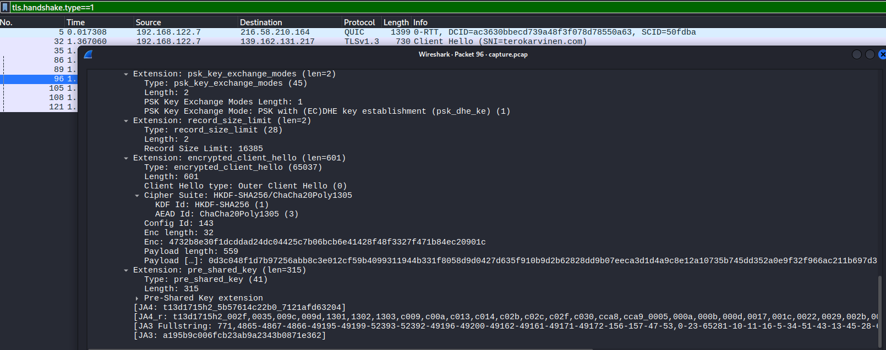

JA3.zone-sivuston perusteella selain olisi joko Chrome tai Firefox.

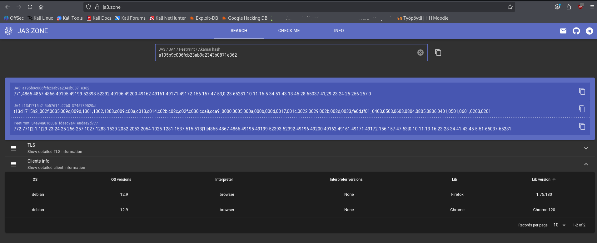

### g) Minkä merkkinen verkkokortti käyttäjällä on? surfing-secure.pcap

Verkkokortin valmistajan voisi löytää MAC-osoitteesta, jonka kolme ensimmäistä oktettia tulevat valmistajalta. (Lähde: https://aruljohn.com/mac.pl)

Kaappauksessa Ethernet-kehysten MAC-osoitteet alkavat 52:54:00. Yritin etsiä sitä MAC-osoitteiden tietokannoista, mutta sitä ei löytynyt. ChatGPT sanoi, että kyseessä on Red Hatin virtualisointi-stacki, jossa käytetään kyseisellä osoitteella alkavaa MAC-osoitetta. Google-haun tekoäly-tiivistelmä kertoi samaa, eli että se on usein käytetty vendor-tunniste virtuaalikoneille, kuten niille joita käytetään Red Hat Enterprise Linux-ympäristöissä.

### h) Millä weppipalvelimella käyttäjä on surffaillut? surfing-secure.pcap. 

__Huonoja uutisia: yhteys on suojattu TLS-salauksella.__

Koska vinkkinä oli, että yhteys on suojattu, niin mietin että pitäisikö tässä yrittää selvittää varsinainen palvelinohjelma (esim. Apache). ChatGPT sanoi, että se saattaisi joskus olla mahdollista käyttämällä palvelimen sertifikaattikenttiä, JA3S:ää ja ALPN/extension-kuvioita (patterns). Sellaista en kuitenkaan lähtenyt edes yrittämään.

Kaappauksesta näkyy, että SNI=terokarvinen.com. SNI:tä (Server Name Indication) käytetään TLS-kättelyssä varmistamaan, että client näkee oikean SSL-sertifikaatin. Näin laite pystyy avaamaan turvatun yhteyden tiettyyn domain-nimeen, vaikka samassa IP-osoitteessa olisi hostattuna myös muun nimisiä nettisivuja. (Lähde: https://www.cloudflare.com/learning/ssl/what-is-sni/)

Ilman SNI:tä client saattaisi saada palvelimelta SSL-sertifikaatin, jonka nimi ei täsmää sitä, johon client on pyrkimässä. Silloin client saa varoituksen "Your connection is not private". (Lähde: https://www.cloudflare.com/learning/ssl/what-is-sni/)

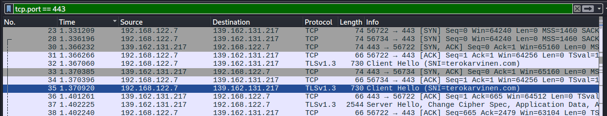

### i) Analyysi. Sieppaa pieni määrä omaa liikennettäsi. Analysoi se, eli selitä mahdollisimman perusteellisesti, mitä tapahtuu. (Tässä pääpaino on siis analyysillä ja selityksellä, joten liikennettä kannattaa ottaa tarkasteluun todella vähän - vaikka vain pari pakettia. Gurut huomio: Selitä myös mielestäsi yksinkertaiset asiat.)

Otin tarkasteluun QUIC-protokollan paketin, jonka Info alkaa "Initial". 216.58.210.174 on Googlen IP-osoite, eli olin kirjautumassa Googleen.

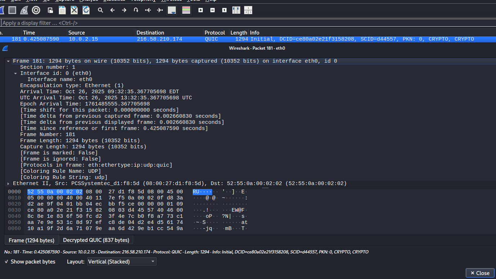

Joitakin kohtia kehyksestä:  

Frame 181: (kehyksen numero 181 Wiresharkin kaappauksessa)  
Kehyksen koko 1294 tavua, joista kaikki on saatu kaapattua.   
Interface eth0, jonka id on 0.  
Encapsulation type: Ethernet. Vaikka itse yhteys on WLAN, niin käyttöjärjestelmä poistaa WLANin kehyksen, ja Wireshark sieppaa sen sisällä olevan Ethernet-keyhksen. (Lähde: https://superuser.com/questions/1242454/why-do-i-see-ethernet-ii-protocol-in-wireshark-in-wireless-connection)

Timeshiftillä voi muuttaa aikaleimaa (Lähde: https://www.wireshark.org/docs/wsug_html_chunked/ChWorkShiftTimePacketSection.html)

Time delta - kertovat ajan edelliseen kaappaukseen (Lähde: https://osqa-ask.wireshark.org/questions/53373/rtp-time-delta-from-previous-packet/)

Frame is marked & ignored - Wiresharkissa käyttäjä voi itse merkitä tai ignoorata kehyksiä. (Lähde: ChatGPT)

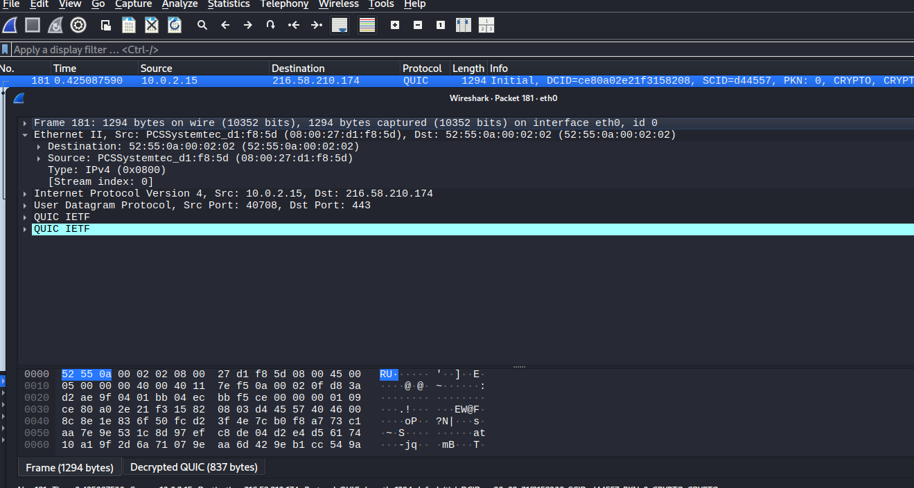

Ethernet II näyttää lähteen ja kohteen MAC-osoitteet. PCSSYstemtec_d1:f8:5d tulee siitä, että Wireshark on yrittänyt näyttää vendorin MAC-osoitteen. Se on siis oman VirtualBoxini MAC-osoite. (Lähde: https://forums.virtualbox.org/viewtopic.php?t=98447)

Kohdeosoite tässä on kaiketi VirtualBoxin NAT-interface. (Lähde: ChatGPT)

Stream index: 0, eli ensimmäinen paketti 

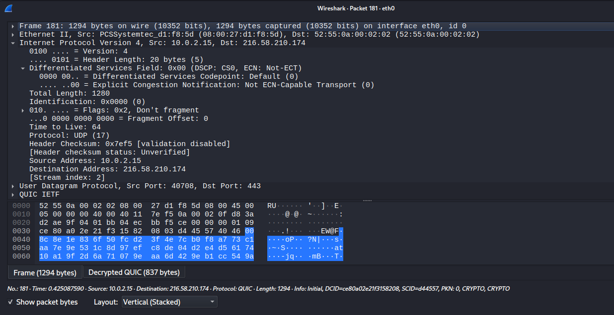

Internet-kerroksessa näkyy mm. lähteen ja kohteen IP-osoitteet.

Internet protocol version 4, identification: 0x0000 (0), eli ei ole fragmentoitu (Lähde: ChatGPT)

Time to Live: Kun tämä menee nollaan, paketin silloin saava laite heittää sen menemään.

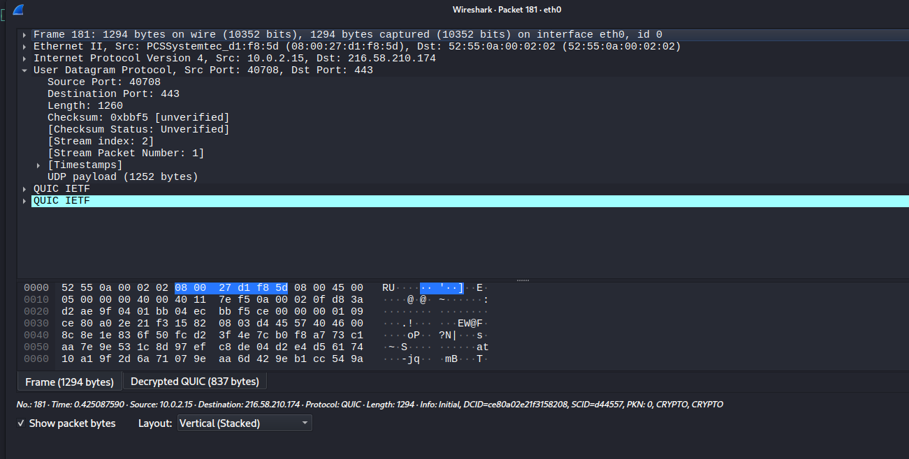

Kuljetus-kerros:

User Datagram Protocol eli tilaton "best-effort"-protokolla.

Lähteen porttina satunnainen iso porttinumero, kohdeportti 443 eli HTTPS.

Checksum - tarkistussumma

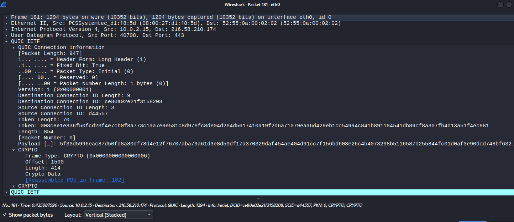

Sovelluskerros, jossa tässä paketissa on QUIC-protokolla.

Token length: 70 eli 70 tavua 

Token: Binääridata, jota palvelin käyttää varmistamaan clientin identiteetin. Jos client on jo aiemmin todentanut IP-osoitteensa, ei tarvita kokonaista kättelyä. 

Kun QUIC-client ottaa yhteyden ensimmäisen kerran, cient lähettää paketin, jossa Token Length = 0. Palvelin vastaa retry-paketilla, jossa on Token. Client uudelleenlähettää ensin lähettämänsä paketin ja sisällyttää siihen palvelimen antaman Tokenin. Näin se todistaa palvelimelle omistavansa kyseisen IP-osoitteen. 

Length: Paketin koko Length-kentän jälkeen, eli paketin numero ja salattu payload. Pituus tarvitaan, koska QUIC salaa kaiken headerin jälkeen, mukaan lukien pakettinumeron. Pituuden avulla vastaanottaja tietää, mistä alkaa salauksen purun. 

Payload: paketissa oleva salattu sisältö

Frame type: identifioi CRYPTO-kehyksen (0x06)
Offset: kertoo mistä kohtaa TLS-viestin striimiä tämä fragmentti alkaa
Length: kuinka monta tavua kättelydataa tässä kehyksessä on
Crypto Data: varsinaiset TLS-kättelyn tavut
[Reasssembled PDU in frame: 182]: Wireshark on koostanut tämän CRYPTO-datan myös muista fragmenteista ja näyttää kokonaisen TLS-kättelyviestin kehyksessä 182 

(Lähde edellisen kuvan selityksille: ChatGPT)

Jostain syystä halusin selvittää, pystynkö purkamaan oman liikenteeni salauksen. ChatGPT:n kanssa tappelin aikani, kunnes selvisi, että käyttämässäni Firefox-versiossa ei ollut ympäristömuuttujaa SSLKEYLOGFILE. Kokeilin sitten Chromella, eli exporttasin SSLKEYLOGFILEn `export SSLKEYLOGFILE=~/sslkeys.log` ja lisäsin sen Wiresharkiin. Koska en ollut laittanut muuttujaa globaaliksi, piti selain avata samassa terminaalissa, jossa muuttuja oli exportattu. (Lähde: ChatGPT & https://knowledgebase.paloaltonetworks.com/KCSArticleDetail?id=kA14u000000wkvECAQ&lang=en_US%E2%80%A9)

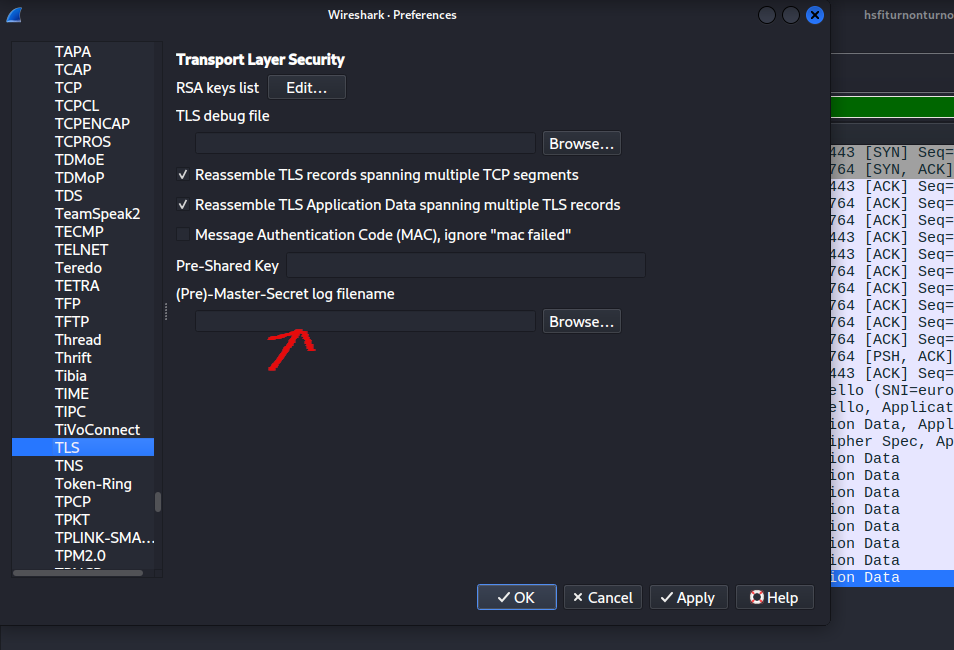

Alla näkyy salattu paketti 1371. Siinä näkyy selkokielisenä vain osoite, joka on jonkinlainen mainoksia nettisivuille tuottava palvelu.

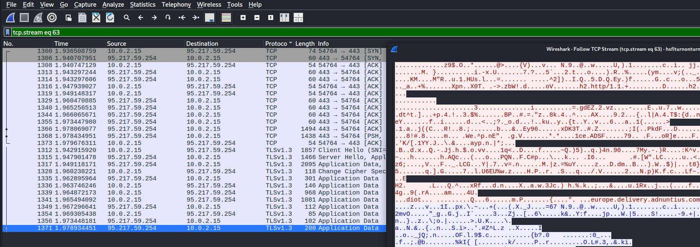

Sama paketti, kun salaus on purettu.
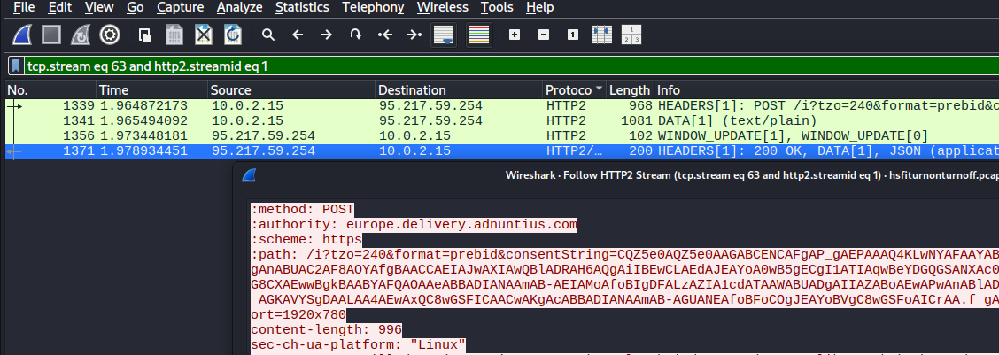

    

    
