## h2: Lempiväri: violetti
Tehtävät https://terokarvinen.com/verkkoon-tunkeutuminen-ja-tiedustelu/#h2-lempivari-violetti

### x) Lue ja vastaa lyhyesti kysymyksiin. Tässä alakohdassa x ei tällä kertaa tarvitse lukea artikkeleita kokonaan, ei tarvitse tiivistää niitä, eikä tehdä testejä koneella.
**Selitä tuskan pyramidin idea 1-2 virkkeellä. Bianco 2013: [Pyramid of Pain](https://detect-respond.blogspot.com/2013/03/the-pyramid-of-pain.html). (Katso eritoten pyramidin kuvaa.)**

Pyramid of Pain -konsepti kuvastaa sitä, että kun verkkohyökkääjä jättää itsestään jälkiä, kannattaa pyrkiä pureutumaan niihin toimintoihin, joiden korvaaminen hyökkääjälle on kaikkein vaikeinta. Esimerkiksi IP-osoitteiden vaihtaminen on hyökkääjälle triviaalia, joten niiden estäminen ei vaikeuta hyökkääjän toimia paljoakaan, mutta esimerkiksi työkalujen ja etenkin kokonaisten toimintatapojen muuttaminen vie hyökkääjältä resursseja, ja siksi suojaustoimenpiteet kannattaa kohdistaa niihin. 

**Selitä timanttimallin (Diamond Model) idea 1-2 virkkeellä. Tekijä esittelee sen aika juhlallisesti, voit myös etsiä yksinkertaisempia artikkeleita hakukoneella tai kelata suoraan timantin kuvaan. Caltagirone et al 2013: [Diamond Model](https://www.threatintel.academy/wp-content/uploads/2020/07/diamond-model.pdf)**

Timanttimallissa on neljä komponenttia: hyökkääjä (adversary), hyökkääjän käyttämä infrastruktuuri, hyökkääjän kyvykkyydet (capabilities) ja uhri. Niitä ja niiden välisiä suhteita (esim. hyökkääjän motiivi kyseistä uhria vastaan) analysoimalla saadaan hyödyllistä tietoa, jota voidaan myös jakaa muiden tietoturvaorganisaatioiden välillä. (Lähde: https://www.eccouncil.org/cybersecurity-exchange/ethical-hacking/diamond-model-intrusion-analysis/)

### a) Apache log. Asenna Apache-weppipalvelin paikalliselle virtuaalikoneellesi. Surffaa palvelimellesi salaamattomalla HTTP-yhteydellä, http://localhost . Etsi omaa sivulataustasi vastaava lokirivi. Analysoi yksi tällainen lokirivi, eli selitä sen kaikki kohdat. (Jos Apache ei ole kovin tuttu, voit tätä tehtävää varten vain asentaa sen ja testata oletusweppisivulla. Eli ei tarvitse tehdä omia kotisvuja tms.)

Aluksi suoritin komennon ``sudo apt-get update`` ja sen jälkeen ``sudo apt-get upgrade``, koska Kali tykkää päivittyä jatkuvasti. 

Kokeilin komennolla ``which apache2``, ja sieltähän Apache jo löytyi asennettuna. Sitten komento ``sudo systemctl start apache2``.

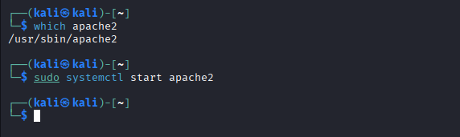

Katsoin selaimessa osoitteen http://localhost/, ja siellä näkyi Apachen oletussivu niin kuin pitikin. 

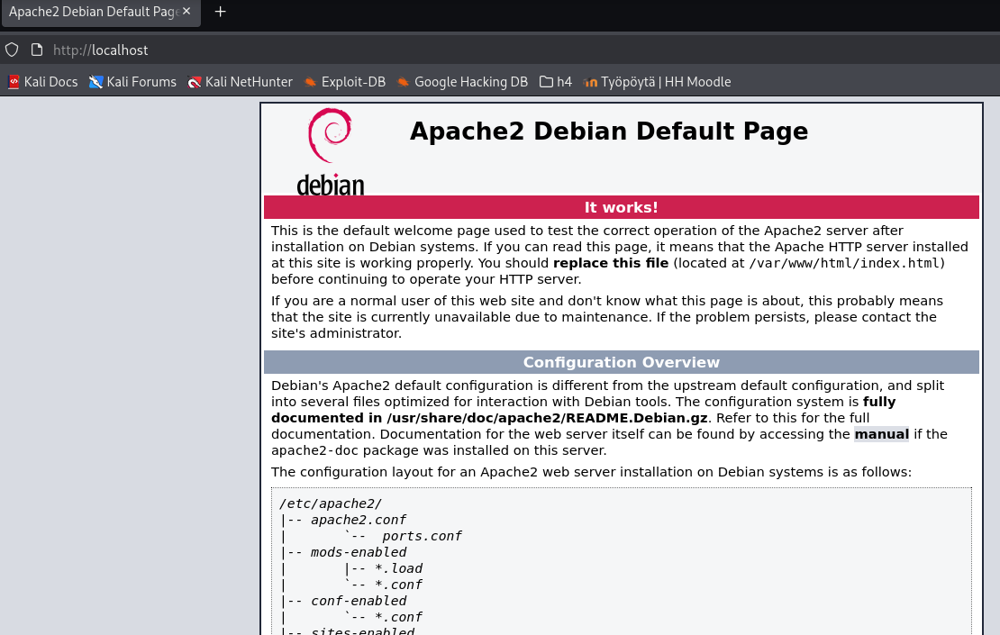

Tehtävän vinkkilistasta löytyi komento ``sudo tail -F /var/log/apache2/access.log``. Tail näyttää tiedoston viimeiset kymmenen riviä. "-F" tarkoittaa, että tiedoston rivejä tulostetaan sitä mukaa, kun niitä tulee lisää, eli esimerkiksi jos lokiin tulee lisää rivejä. (Lähde: man tail ja https://www.ibm.com/docs/ro/aix/7.2.0?topic=t-tail-command)

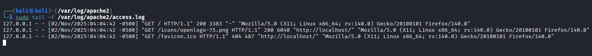

Analysoitava rivi:

127.0.0.1 - - [02/Nov/2025:04:04:42 -0500] "GET / HTTP/1.1" 200 3383 "-" "Mozilla/5.0 (X11; Linux x86_64; rv:140.0) Gecko/20100101 Firefox/140.0"

Lähteenä käytetty, ellei erikseen muuta ole mainittu: https://httpd.apache.org/docs/2.4/logs.html

127.0.0.1 - Osoite, josta pyyntö tuli palvelimelle. 127.0.0.1 on localhost, eli tietokoneen oma "sisäinen" IP-osoite, jota voidaan käyttää testaamiseen.

\- Viiva tarkoittaa puuttuvaa tietoa. Ensimmäinen viiva on laitteen identd (identity). Standardin mukaan se on epäluotettava, eikä sitä tulisi käyttää kuin tiukasti kontrolloiduissa sisäisissä verkoissa. Apache ei yritä selvittää sitä, ellei IdentityCheck ole asetettu tilaan "On."

\- Käyttäjän id, joka tässä tapauksessa on tyhjä, koska haettu dokumentti ei ole salattu eikä käyttäjää siis ole todennettu.

[02/Nov/2025:04:04:42 -0500] - Aikaleima, jossa viimeisenä aikaero UTC-aikaan nähden.

"GET / HTTP/1.1" - Asiakkaan tekemä pyyntö. Get-metodi, eli on pyydetty juurisivu "/" ja protokollana HTTP/1.1

200 - Palvelimen asiakkaalle lähettämä statuskoodi. Koodi 200 tarkoittaa "OK" (Lähde: https://www.w3.org/Protocols/rfc2616/rfc2616.txt)

3383 - Asiakkaalle palautetun objektin koko. 

Yllä oleva on "Common Log Format", mutta koska lokissa näkyy vielä lisää tavaraa, niin lokimerkintä on formaattia "Combined Log Format". 

"-" - Tässä näkyisi se URL, jonka kautta asiakas on tullut, mutta se on tyhjä, koska laitoin localhostin osoitteen suoraan selaimen osoitekenttään.

"Mozilla/5.0 (X11; Linux x86_64; rv:140.0) Gecko/20100101 Firefox/140.0" - Viimeisenä tietona näkyy asiakkaan user-agentin (eli tässä selaimen) tekemän HTTP-pyynnön otsikkotiedot.

Lähde otsikkotiedoille, ellei muuta ole mainittu: https://developer.mozilla.org/en-US/docs/Web/HTTP/Reference/Headers/User-Agent/Firefox.

Otsikkotiedot Mozilla, Gecko ja Firefox kertovat tietoja selaimesta, eli käytännössä, että se on Firefox versio 140. Lisäksi se kertoo tietoja käyttöjärjestelmästä: X11 on Linuxin käyttämä ikkunointisysteemi (Lähde: https://en.wikipedia.org/wiki/X_Window_System). Linux x86_64 viittaa käyttöjärjestelmän arkkitehtuuriin.

#### b) Nmapped. Porttiskannaa oma weppipalvelimesi käyttäen localhost-osoitetta ja 'nmap -A' päällä. Selitä tulokset. (Pelkkä http-portti 80/tcp riittää)

Vinkeistä katsoin komennot ``sudo nmap -A localhost`` ja ``sudo nmap -T4 -vv -A -p 80 localhost``.

Lähde, ellei muuta mainittu:  https://svn.nmap.org/nmap/docs/nmap.usage.txt

\-A : Tämä on jonkinlainen komentopaketti, jolla voidaan skannata käyttöjärjestelmää, versiota, skriptejä ja traceroute. 

\-T4 - T4 tekee skannauksesta nopeamman. T3 on normaali nopeus, T0 on "paranoid" eli yrittää pysyä piilossa. (https://nmap.org/book/performance-timing-templates.html)

\-vv - Kertoo enemmän tietoja skannatessaan (verbose)

\-p - Määritellään portit, jotka skannataan

Katkaisin Kalin nettiyhteyden ja kokeilin nmap.komentoja. Ensimmäisellä komennolla ilman -vv:tä tuli paljon vähemmän tietoa skannauksesta.

Ensimmäinen skannaus ``sudo nmap -A localhost``  
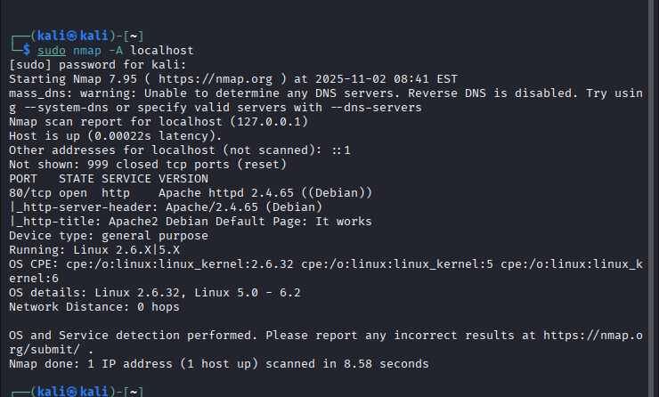

Toinen skannaus ``sudo nmap -T4 -vv -A -p 80 localhost``  
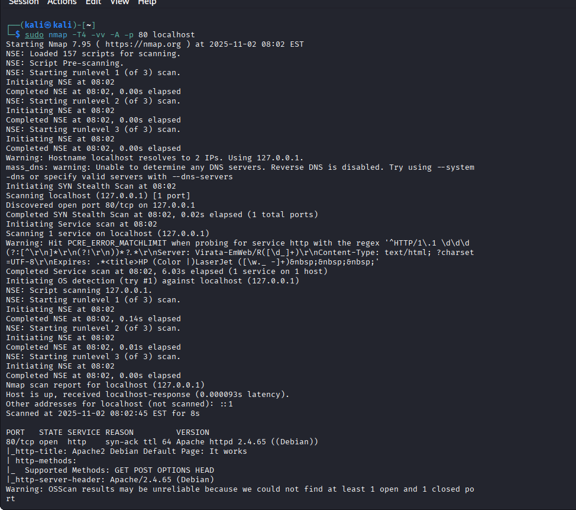

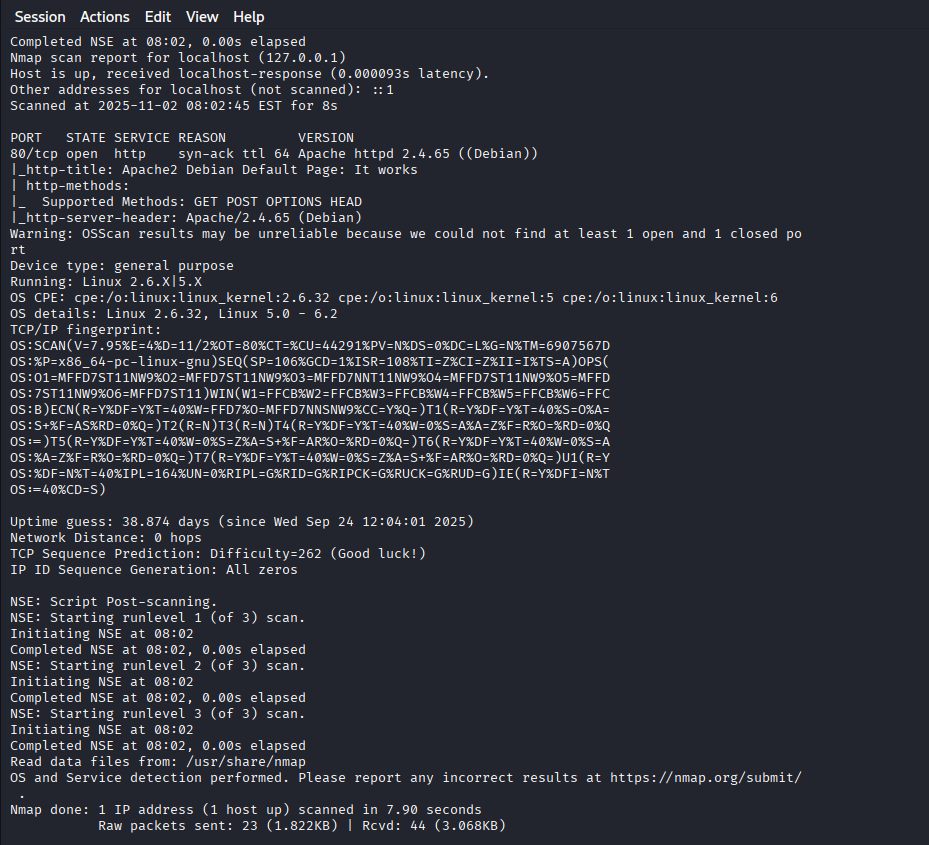

Lyhyemmän tuloksen tulkinta:

mass_dns: unable to determine any DNS servers, tämä johtuu siitä, että skannaan omaa ympäristöäni, eikä VM ole edes yhteydessä internetiin (Lähde: https://medium.com/@beingnile/day-61-more-nmap-45f059621edc) 

Host is up (0.00022s latency) - Nmap tarkistaa, että kohde on toiminnassa  

Other addresses for localhost (not scanned): ::1 - ::1 on IPv6:n loopback-osoite   

Not shown: 999 closed tcp ports (reset) - Nmap skannasi 1000 yleisintä porttia ja näyttää sen yhden, joka oli auki

80/tcp open - tämä portti oli avoin, ja siinä pyörii Apachen httpd-demoni

http-server-header: Apache/2.4.65 - Palvelimen versio (https://nmap.org/nsedoc/scripts/http-server-header.html)

http-title: Apache2 Debian Default Page: It works - Näyttää palvelimella olevan sivun otsikon (https://nmap.org/nsedoc/scripts/http-title.html)

Device type: general purpose - Tarkoittaa yleisen käytön järjestelmiä kuten Linux tai Windows. Muita mahdollisuuksia voisi olla esimerkiksi reititin. (https://nmap.org/book/osdetect-device-types.html

Sitten se näyttää tietoja käyttöjärjestelmästä. En saanut selvää, mitä "Linux 2.6.x|5.X" tarkoittaa. 

Network Distance: 0 hops - Koska skannattiin localhostia eli samaa konetta, hyppyjä on nolla. Muussa tapauksessa se laskisi matkalla olleiden reitittimien määrän. (https://nmap.org/book/osdetect-usage.html)

### c) Skriptit. Mitkä skriptit olivat automaattisesti päällä, kun käytit "-A" parametria? (Näkyy avoimien porttinumeroiden alta, http-blah, http-blöh...).

Skannauksen tuloksessa näkyy http-server-header ja http-title.

### d) Jäljet lokissa. Etsi weppipalvelimen lokeista jäljet porttiskannauksesta (NSE eli Nmap Scripting Engine -skripteistä skannauksessa). Löydätkö sanan "nmap" isolla tai pienellä? Selitä osumat. Millaisilla hauilla tai säännöillä voisit tunnistaa porttiskannauksen jostain muusta lokista, jos se on niin laaja, että et pysty lukemaan itse kaikkia rivejä?

Hakemistosta /var/log/apache2/ löytyy Apachen access.log. Tutkin lokia komennolla ``less access.log``.

Komennolla ``less access.log | grep -i nmap`` voi tulostaa ne rivit, joissa on nmap (kirjainkoosta riippumatta).

Lokissa näkyy nmapin tekemät pyynnöt Apache2-webpalvelimelle.

Esimerkkirivi:

Lokissa näkyy, että jokin asiakas on tehnyt muun muassa GET- ja POST-pyyntöjä palvelimelle. User-agent-kohdassa näkyy "Mozilla/5.0 (compatible; Nmap Scripting Engine; https://nmap.org/book/nse.html"). Se antaa aika ilmeisen viitteen siitä, että palvelinta on skannattu nmapilla.

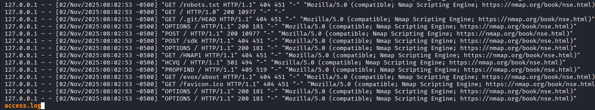

Komento ``less access.log | grep -i nmap`` näyttää punaisella sen tekstin, jota grep-toiminnolla on haettu.
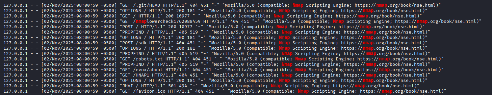

### e) Wire sharking. Sieppaa verkkoliikenne porttiskannatessa Wiresharkilla. Huomaa, että localhost käyttää "Loopback adapter" eli "lo". Tallenna pcap. Etsi kohdat, joilla on sana "nmap" ja kommentoi niitä. Jokaisen paketin jokaista kohtaa ei tarvitse analysoida, yleisempi tarkastelu riittää.

Laitoin Wiresharkin päälle, valitsin interfacen "Loopback:lo" ja aloitin kaappauksen. Suoritin nmap-komennon, jolla skannasin vain portin 80 ja lopuksi lopetin Wireshark-kaappauksen

Yritin etsiä silmämääräisesti nmapia Wireshark-kaappauksesta, mutta en huomannut sitä. Käytin sitten tehtävävinkkien filtteriä 'frame contains "nmap"'.

Kaapppaukset filtteröitynä ``frame contains "nmap"``  
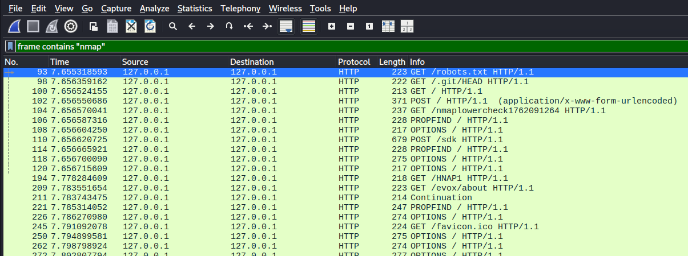

Nmap näkyi paketissa HTTP-paketin User-agent -kohdassa.  
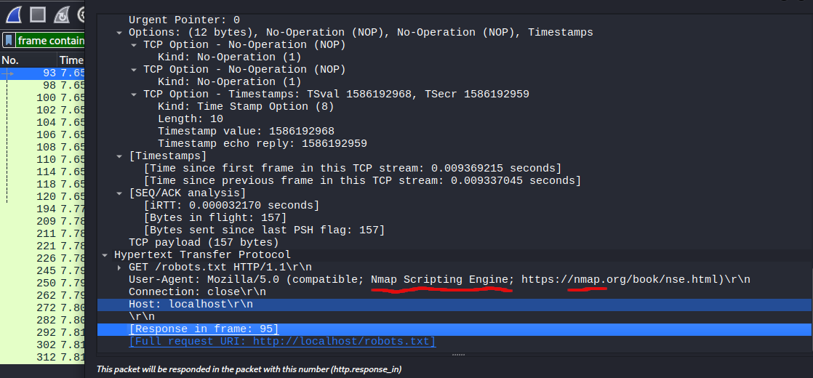

### f) Net grep. Sieppaa verkkoliikenne 'ngrep' komennolla ja näytä kohdat, joissa on sana "nmap".

Tehtävän vinkeissä oli mainittu komento ``sudo ngrep -d lo -i nmap``.

ngrepin manuaalista: 

d - Tällä voidaan valita interface, jota kuunnellaan (tässä siis "lo")

i - ignore case, eli komento ei välitä kirjainkoosta

Ngrepin tuloste näyttää jonkin verran samalta kuin access.log.

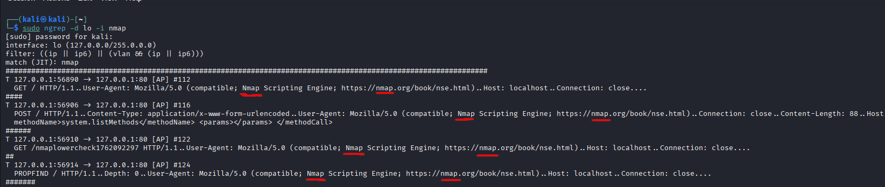

### g) Agentti. Vaihda nmap:n user-agent niin, että se näyttää tavalliselta weppiselaimelta.

Tehtävien vinkeissä neuvottiin, että user-agentin voi vaihtaa lisäämällä nmap-komentoon "--script-args http.useragent="user-agentin stringi"

Esimerkiksi ``sudo nmap -A -p 80 --script-args http.useragent="Mozilla/5.0 (X11; Linux x86_64; rv:140.0) Gecko/20100101 Firefox/140.0" localhost``

### h) Pienemmät jäljet. Porttiskannaa weppipalvelimesi uudelleen localhost-osoitteella. Tarkastele sekä Apachen lokia että siepattua verkkoliikennettä. Mikä on muuttunut, kun vaihdoit user-agent:n? Löytyykö lokista edelleen tekstijono "nmap"?

Suoritin edellä mainitun komennon ``sudo nmap -A -p 80 --script-args http.useragent="Mozilla/5.0 (X11; Linux x86_64; rv:140.0) Gecko/20100101 Firefox/140.0" localhost``. 

Nyt kun katsoin access.log-tiedostoa, niin siellä näkyi user-agentin kohdassa laittamani string, ja ainoa "nmap"-teksti oli GET-pyynnössä näkyvä "nmaplowercheck1762119507".

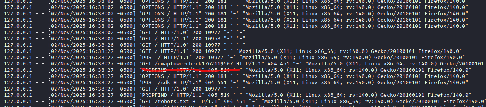

Wiresharkissakin näkyi nyt vain yksi paketti, josta löytyi "nmap".

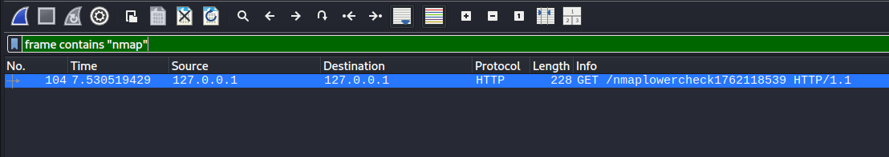

### i) Hieman vaikeampi: LoWeR ChEcK. Poista skritiskannauksesta viimeinenkin "nmap" -teksti. Etsi löytämääsi tekstiä /usr/share/nmap -hakemistosta ja korvaa se toisella. Tee porttiskannaus ja tarkista, että "nmap" ei näy isolla eikä pienellä kirjoitettuna Apachen lokissa eikä siepatussa verkkoliikenteessä. (Tässä tehtävässä voit muokata suoraan lua-skriptejä /usr/share/nmap alta, 'sudoedit'. Muokatun version paketoiminen siis rajataan ulos tehtävästä.)

Hakemistosta /usr/share/nmap löytyi http.lua-tiedosto, josta löytyi teksti nmaplowercheck... Tein ensin tiedostosta varmuuskopion ja muokkasin sitä sitten komennolla ``sudoedit http.lua``.

Muutin http.lua-tiedostossa nmaplowerchek-kohdan tekstiksi nothingHere. 

Kun taas tein porttiskannauksen, niin sen jälkeen Apache-lokissa ei enää näkynyt nmapia. Koska olin tehnyt tämän viimeisen skannauksen seuraavana päivänä, niin etsin ensin access.logista sen päivän lokimerkinnät komennolla ``grep "03" access.log`` ja sitten ``grep "03" access.log | grep -i nmap``, josta ei tullut tuloksia, eli nmap ei enää näkynyt lokissa. (Komennon tekemisessä auttoi ChatGPT, jolta siis kysyin, että miten grep-toiminnolla voi etsiä kahta stringiä yhtä aikaa samoilta riveiltä.)

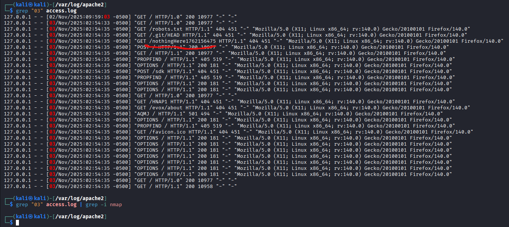

Wiresharkin kaappauksessakaan ei enää näkynyt tekstiä "nmap".  

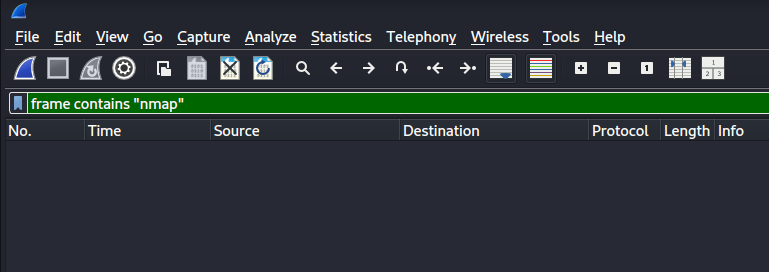

Loppuhuomautus: Tein lua-muutokset itse asiassa kaksi kertaa. Kun ensimmäisellä kerralla muutin user-agentin "väärentämällä" selain-stringin nmap-komentoon, niin näin silti lokeissa "Nmap Scripting Engine". Muutin sitten http.lua-kohdassa "USER_AGENT" (alla kuvassa). Ja sen jälkeen näkyviin jäi vain "nmaplowercheck...". Mutta kun mielestäni sitten palautin kaikki alkuperäisiksi asetuksiksi ja tein nmap-komennon stringin muutoksen uudelleen, niin enää ei lokissa näkynytkään muuta "nmap"-tekstiä, kuin sen "nmaplowercheck...". En tiedä mistä tämä johtui, eli johtuiko se nmapin toiminnasta vai jostain, mitä itse tein.

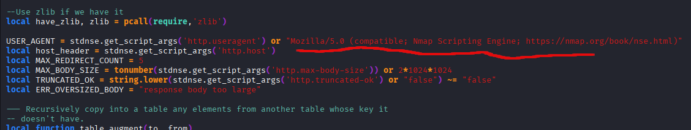

