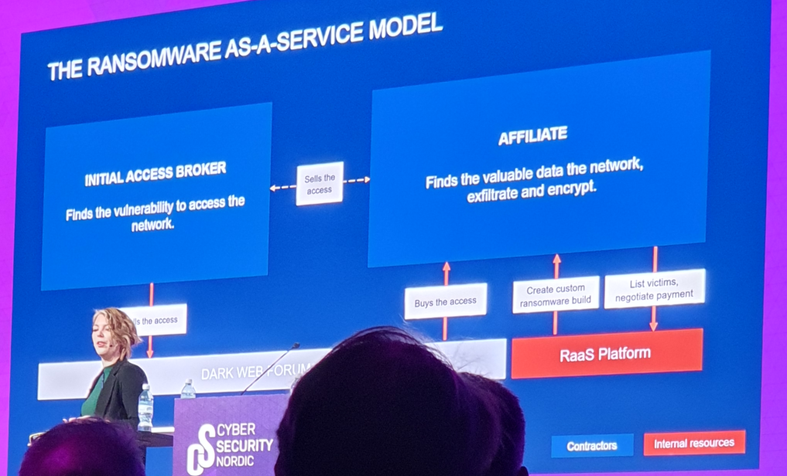

## h3 Messuilla
**Osallistu Cyber Security Nordic -tapahtumaan.** [Tehtävänanto](https://terokarvinen.com/verkkoon-tunkeutuminen-ja-tiedustelu/#h3-messuilla)

Tiistai 4.11.2025 Cyber Security Nordic -messut

Keskustelin aluksi [Traficomin](https://www.traficom.fi/fi) edustajan kanssa. Työpaikallani saatetaan tehdä sisäisiin tietoturvakäytäntöihin liittyvä projekti, ja oli mielenkiintoista kuulla, minkälaisia palveluja ja tiedotusta Traficom tarjoaa. Täytyy itsekin alkaa ainakin seurata Traficomin alaisen Kyberturvallisuuskeskuksen julkaisemia tietoturvatiedotteita [Viikkokatsaus](https://www.kyberturvallisuuskeskus.fi/fi/viikkokatsaus) ja [Kybersää](https://www.kyberturvallisuuskeskus.fi/fi/ajankohtaista/kybersaa).

Katsoin lisäksi pari esitystä, joista ensimmäinen oli [Cyberdayn](https://www.cyberday.ai/) toimitusjohtaja Ismo Paananen. Hän esitteli tekoälyavusteista tuotetta, jonka avulla yritykset voivat luoda tietoturvakäytäntöjä, valvoa niiden toteutumista ja reagoida muuttuviin tietoturvavaatimuksiin. Tajusin vasta kotona Cyberdayn nettisivuja lukiessani, että kyseessä taitaa olla juuri se kehys, jota työpaikassani ehkä aletaan käyttää, eli suomeksi sitä kutsutaan nimellä [Digiturvamalli](https://www.digiturvamalli.fi/).

Toisen katsomani esityksen piti Lucie Gardiet yrityksestä [Vectra](https://www.vectra.ai/). Vectra AI on kuulemma opettanut tekoälylle verkkohyökkääjien toimintatapoja jo 15 vuotta. Vaikka verkkoja kuinka yrittäisi suojata, niin joskus hyökkääjä kuitenkin pääsee sisälle. Vectra AI voi esimerkiksi tunnistaa, jos käyttäjä kirjautuu kyseiselle käyttäjälle epätyypilliselle työasemalle, mikä voi tarkoittaa, että käyttäjän tunnus on väärissä käsissä. 

Esityksessä kerrottiin myös konseptista "Ransomware-as-a-service" (RaaS), jossa rikolliset kehittävät ja sitten maksua vastaan tarjoavat työkaluja, joilla voi hetkessä rakentaa kustomoituja kiristysohjelmia. Aika hurjaa.

  <strong>Lucie Gardiet esittelee kiristysohjelmien nykypäivää eli Ransomware-as-a-service -bisnestä.</strong> 

