## h5 kotitehtävät 

**a) Tutustu seuraavaan työkaluun**

https://github.com/kgretzky/evilginx2  
**Vastaa seuraaviin kysymyksiin**  
**Asensitko työkalun, jos asensit niin kirjoita miten sen teit.**  
**Mitä teit työkalun kanssa?**  
**Onnistuitko huijaamaan liikennettä**  
[Tehtävänanto](https://terokarvinen.com/verkkoon-tunkeutuminen-ja-tiedustelu/#h5-laboratorio--ja-simulaatioymparistot-hyokkayksissa)

### Evilginx2:n asennus
Ympäristö:  
__Isäntäkone__  
11th Gen Intel(R) Core(TM) i5-11400H @ 2.70GHz (2.69 GHz)  
RAM 16 GB  
Windows 11 Home Version 24H2  

__Virtuaalikone__  
Oracle VirtualBox    
Version 7.1.12 r169651 (Qt6.5.3)  

__Kali Linux__    
Pre-Made Kali VirtualBox VM  
https://www.kali.org/get-kali/#kali-virtual-machines 

Luin ensin taustaa Evilginxistä: https://breakdev.org/evilginx-2-next-generation-of-phishing-2fa-tokens/. 

Työkalu toimii siis reverse proxyna uhrin ja nettisivuston välissä ja kaappaa uhrin session, kun tämä kirjautuu nettisivustolle. Sen oikeaan käyttöön tarvittaisiin oma domain ja virtuaalipalvelin, johon uhri huijataan menemään. Etsin tietoa siitä, miten sitä voisi käyttää localhostissa, ja löysin YouTube-videon, jonka perusteella asensin työkalun. https://www.youtube.com/watch?v=z5gLXmXIyH8 Kaikki tässä tehtävässä tekemäni komennot on siis tehty videon neuvojen mukaisesti.

Työkalun asennus komennolla ``sudo apt install evilginx2``. 
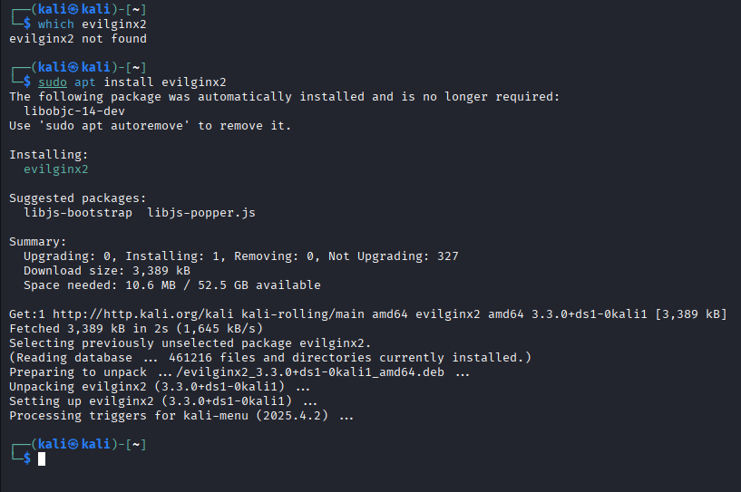

Domainina käytin yleistä testidomainia example.com, jonka lisäsin Kalin hosts-tiedostoon, jotta example.comiin menevä liikenne ohjautuu localhostiin. Lisäsin hosts-tiedostoon example.com, &#8203;​www.example.com ja login.example.com. 

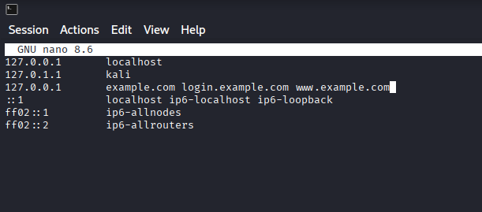

Kun kokeilin laittaa &#8203;example.com Kalin selaimeen, niin se ei mennyt mihinkään, vaikka kyseessä on oikea domain, eli sen ohjaus hosts-tiedoston kautta omaan localhostiini toimi.

Evilginx2 käyttää "phishlettejä", joilla uhrille esitetään oikean näköinen nettisivun sisäänkirjautumissivu. Käytin LinkedIn.com-phishletiä, jonka kopioin täältä: https://github.com/ArchonLabs/evilginx2-phishlets/blob/master/phishlets/linkedin.yaml ja muutin kohdat 'hostname' > 'example.com'. Alkuvaiheessa muokkailin phishlettejä enemmänkin, mutta lopulta käytin tätä kopioimaani valmista phishlettiä, koska Evilginx2 ei tykännyt omista yrityksistäni.

#### Evilginx2:n käyttö

Käynnistin työkalun komennolla ``sudo evilginx2 --developer``. Developer-moodia käytetään, koska kyseessä on localhost.

Kuvakaappaus on myöhemmästä vaiheesta, jossa olen poistanut example-phishletin ja lisännyt oman sekä enabloinut sen.
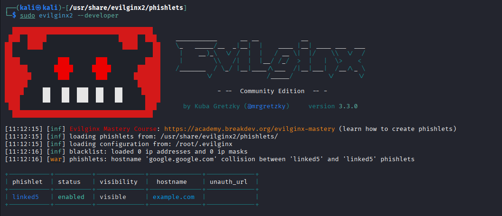

Työkalun käynnistyttyä asetin domainiksi &#8203;example.com komennolla ``config domain example.com`` ja IP-osoitteeksi localhost-osoitteen 127.0.0.1 komennolla ``config ipv4 127.0.0.1``. Jos minulla olisi oma domain ja virtuaalinen palvelin, olisin asettanut domainiksi omistamani domainin ja sen IP-osoitteen.

Sitten yhdistin phishletin domainiin komennolla ``phishlets hostname linked5 example.com`` ja enabloin phishletin ``phishlets enable linked5``.

Lures-komennoilla loin linkin, jolla uhria huijataan: ``lures create linked5`` ja ``lures get-url 11``. (Numero 11 tulee siitä, että olin aiemmin tehnyt saman asian kymmenen kertaa.)

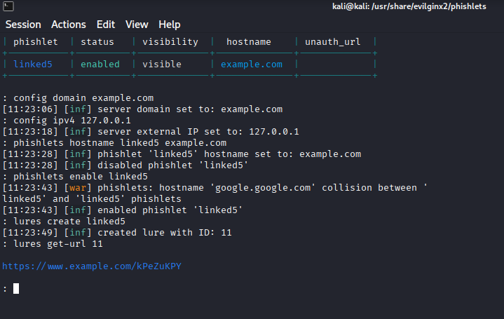

### Liikenteen huijaaminen

Minua vähän epäilytti, että onko OK käyttää oikeaa nettisivua tällaiseen kokeiluun, tosin YouTubessa on videoita, joilla ihmiset testaavat Evilginxiä ja kaappaavat sillä omia sessioitaan. Työkaluhan käsittääkseni vain toimii "reverse proxyna", eli se on kuin portinvartija, jonka kautta liikenne menee oikealle sivustolle, eikä se millään tavalla vahingoita kohdesivua. ([CloudFlare: What is a reverse proxy?](https://www.cloudflare.com/learning/cdn/glossary/reverse-proxy/)). 

En halunnut käyttää oikeita tunnuksia enkä myöskään tehdä testitunnuksia tähän tarkoitukseen. Katkaisin virtuaalikoneen nettiyhteyden siinä vaiheessa, kun syötin kirjautumissivulle käyttäjätunnuksen ja salasanan, ja se näytti riittävän siihen, että työkalu sai ne kaapattua.

Avasin siis lures-komennolla tekemäni linkin. Localhostissa sijaitseva phishlet näytti ensin varoituksen turvattomasta yhteydestä, mutta koska huijari olin minä itse, niin jatkoin siitä eteenpäin.    
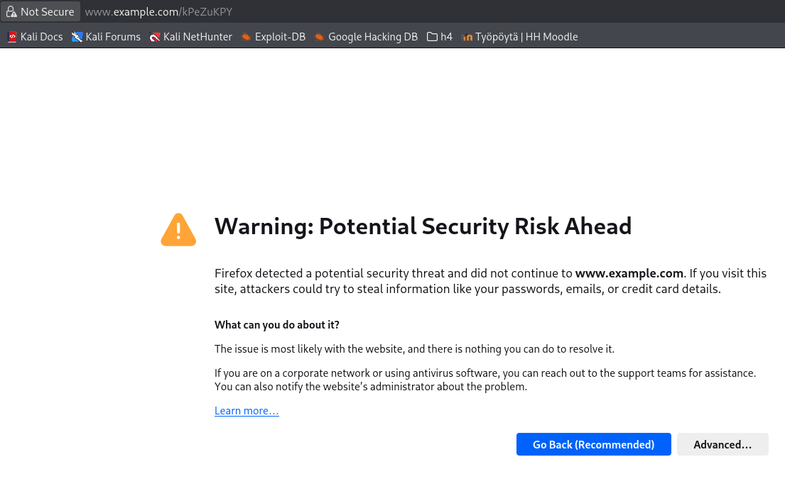

Phishlet loi oikean näköisen kirjautumissivun omaan "domainiini" eli localhostiin. Nettiyhteys oli poikki kun "kirjauduin sisään". Käyttämäni sähköpostiosoitteella ei myöskään ole LinkedIn-tunnusta, enkä tiedä olisiko kirjautuminen ylipäätään toiminut localhost-virityksen kautta.

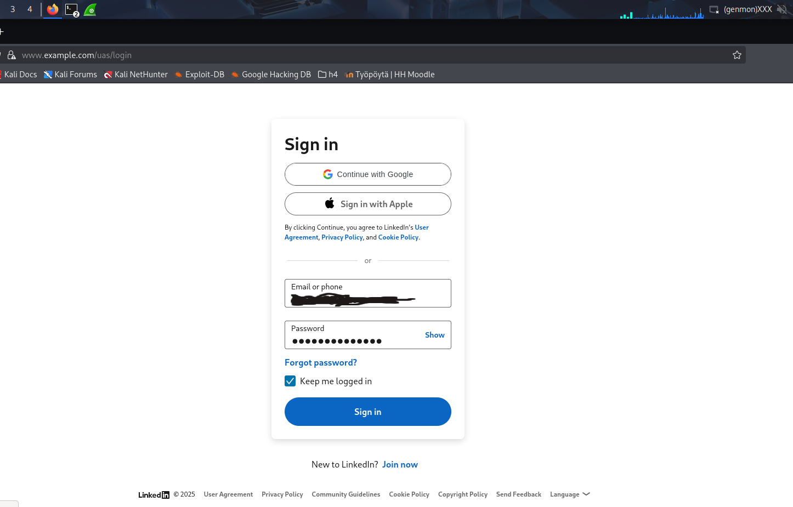

Evilginx2-työkalu sieppasi käyttäjätunnuksen ja salasanan. Koska mitään oikeaa sisäänkirjautumista ei tapahtunut, niin se ei kaapannut session evästeitä. 
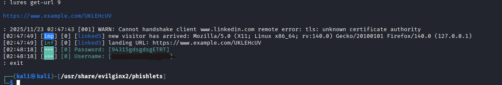

Työkalulla voisi siis kaapata käyttäjän sessioevästeen ja kirjautua itse sisään käyttäjän tilille. Olen kuullut tällaisesta, mutta nyt näin sen omin silmin, että kuinka helppoa se on. Toki uhri pitää huijata ensin menemään väärälle sivustolle, mutta kerrankos sitä joskus esimerkiksi väsyneenä klikkaa väärää linkkiä ja luottaa siihen, että koska käytössä on kaksivaiheinen tunnistus, niin on muka suojassa.

**b) Sinulla on käytössäsi mininet ympäristö. Luo ympäristö, jossa voit tehdä TCP SYN-Flood hyökkäyksen.**  
**Kirjoita miten loit mininet ympäristön ja miten toteutit hyökkäyksen.**

SYN-floodissa hyökkääjä lähettää SYN-viestejä palvelimelle, mutta ei sitten kuittaakaan, kun palvelin lähettää SYN-ACK-viestin takaisin. Näin palvelin kuluttaa resursseja, kun se odottaa puolinaisten yhteyksien aukeamista, joka ei koskaan tapahdu. (Lähde: https://en.wikipedia.org/wiki/SYN_flood)

Komennolla ``sudo mn`` Mininet luo kontrollerin, kytkimen ja hostit. Niiden määrää voi muuttaa parametreilla. Kun komennon eteen laittaa esim. "h1", niin komento suoritetaan h1-hostissa. (Lähde: http://mininet.org/walkthrough/)

Lisäsin opettajalta ladatun Mininet-imagen Virtual Boxiin.

Mininetin aloitusikkuna, kun se on käynnistetty Virtual Boxissa.  
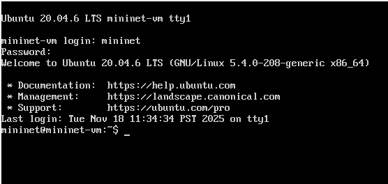

Komento ``sudo mn`` loi oletustopologian, jossa on yksi kytkin, kaksi hostia ja controller.  
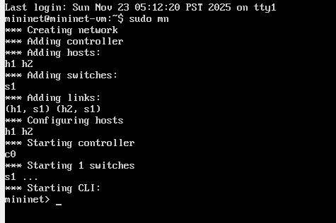

En saanut xtermiä toimimaan luentomateriaalin ohjeella tai mitenkään muutenkaan. 

Ensimmäisen tehtävään meni pitkään, ja Mininettiin keskittyminen sen jälkeen oli erityisen haastavaa. Löysin vain yhden lähteen, jossa puhuttiin TCP SYN-floodista: https://www.sciencedirect.com/science/article/pii/S2352340925000460. Siinä on käytetty monimutkaisempaa Mininet-topologiaa kuin mikä oletustopologia on, eikä sen matkiminen houkutellut.

Lopulta kysyin ChatGPT:ltä, että miten saan tehtyä Mininetissä SYN-floodin. Tästä eteenpäin kaikki komennot on siis ChatGPT:ltä, ja olen vain lisännyt niihin selitykset etsimieni lähteiden mukaan.

Asetin h2-hostiin netcat-komennolla palvelimen, joka kuuntelee porttia 80 (``l/--listen``) ja pitää yhteyden avoinna (``k/--keep-open``) (Lähde: https://phoenixnap.com/kb/nc-command)    
``h2 nc -lk 80 &``

Samaan h2-hostiin laitoin tcpdumpin interfaceen (``-i``) "h2-eth0", se kaappaa vain tcp-liikennettä ja lopuksi tallettaa saamansa tiedot tekstitiedostoon. (Lähde: https://danielmiessler.com/blog/tcpdump)  
``h2 tcpdump -i h2-eth0 tcp > /tmp/cap3.txt &``

Ja lopuksi floodaus host h1:stä h2:sen IP-osoitteeseen hping3-komennolla, eli ``-S`` asettaa SYN-lipun, ``-p 80`` asettaa kohdeportiksi 80 ja ``--flood`` lähettää paketteja niin nopeasti kuin mahdollista näyttämättä vastauksia.  (Lähde: https://www.kali.org/tools/hping3/)  
``h1 sudo hping3 -S --flood -p 80 10.0.0.2``

hping statistic -kohdasta näkyy, että h1 lähetti paljon paketteja, mutta ei saanut yhtään takaisin, koska se on flood-moodissa eikä välitä vastauksista

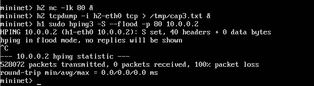

Tcpdump-kaappauksen selitys, tämäkin siis ChatGPT:ltä:

#### h1-hyökkääjän lähettämä paketti:  
**h1.5252** - hyökkääjä käyttää isoja porttinumeroita, joita se tässä hping-komennossa kasvattaa aina yhdellä seuraavassa paketissa   

**Flags [S]** - SYN-lippu eli kolmivaiheisen kättelyn ensimmäinen viesti  

**seq 1177083694** - sekvenssinumero on satunnainen  

**win 512** - kertoo vastaanottajalle lähettäjän ikkunan koon, mutta sillä ei ole merkitystä SYN-floodissa, koska hyökkääjää ei vastaus kiinnosta    

**length 0** - SYN-paketissa ei ole payloadia

#### h2-palvelimen vastaus:
**h2.http > h1.5252** : Vastaa h1-hostin porttiin, josta SYN tuli  

**[S.]** : SYN + ACK  (Lähde: https://www.redhat.com/en/blog/introduction-using-tcpdump-linux-command-line)  

h2:n lähettämä sekvenssinumero on myös satunnainen  

**ack 1177038695** - h1:n lähettämä SYN-sekvenssinumeo + yksi  

**win 4320** - ikkunan koko

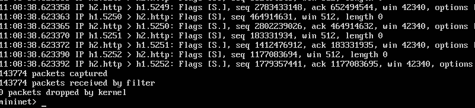

Tcpdump-kaappauksen perusteella (jos ChatGPT:hen on uskominen) SYN-flood onnistui, mutta sitä en pystynyt näyttämään, että h2-host olisi esimerkiksi menettänyt toimintakykynsä floodauksen takia.

Lähteet: Tekstin seassa mainitut + luento-PDF
